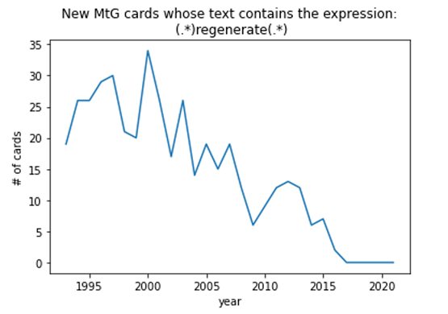

# Plotting Magic: The Gathering Keyword Occurrences Over Time
This jupyter notebook demonstrates how to graph the yearly occurrences of any given keyword or phrase in Magic: the Gathering cards over Magic's entire history. These graphs can show interesting trends in the game, as new mechanics are introduced and old ones fade out. 
  

